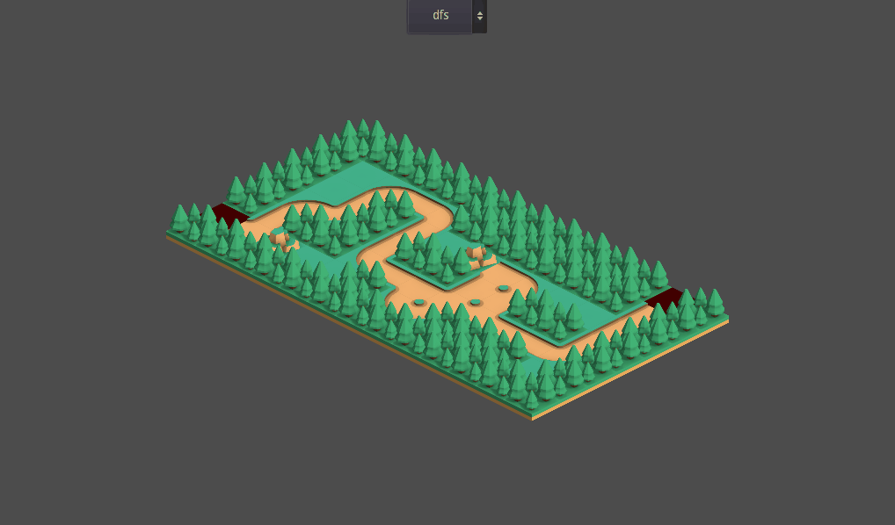

# Godot: Path Finder Project

## Demo link
https://gianistatie.github.io/path-finder/

## Assets
* **Kenney**, Tower Defense Kit - [Link](https://kenney.nl/assets/tower-defense-kit)

## References
* **Barichello**, CI/CD for GitHub pages - [GitHub](https://github.com/abarichello/godot-ci)
* **AndOne**, A* Path-Finding for Grid-Based Tilemap in Godot - [YouTube](https://www.youtube.com/watch?v=dVNH6mIDksQ&ab_channel=AndOne)
* **Gingerageous Games**, Procedural Isometric Tower Defense Map - [YouTube](https://www.youtube.com/watch?v=hVAdr0AboYU&ab_channel=GingerageousGames)